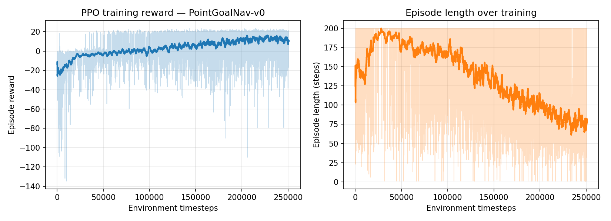

# PointGoalNav-PPO

A custom Gymnasium environment — a 2D point-robot navigating to a goal while
avoiding one or more randomized obstacles — trained with PPO (Stable-Baselines3).
Built as a from-scratch RL problem formulation exercise: designing the
state/action space, dynamics, reward shaping, and domain randomization
myself, rather than only running a stock Gymnasium task.

## The task

A point-mass robot (double-integrator dynamics with drag) starts at a random
position and must reach a randomly placed goal, while avoiding one or more
static circular obstacles placed roughly on the direct path between them —
so the agent actually has to learn to route around them, not just decelerate.

**Domain randomization:** each episode samples a random *number* of
obstacles (1–2) and a random *radius* per obstacle (0.4–0.75), instead of a
single fixed obstacle. The observation only exposes the nearest obstacle's
relative position, not its radius — so the policy can't just memorize one
obstacle geometry, it has to learn a radius-robust "keep clear of things
near my path" behavior. This was specifically added (see "What I'd add
next" below, now done) to check whether the policy generalizes or was just
overfitting to one obstacle config.

- **Observation (8-dim):** position, velocity, vector to goal, vector to
  nearest obstacle.
- **Action (2-dim, continuous):** thrust command in x/y.
- **Episode ends on:** reaching the goal (success), hitting any obstacle,
  leaving the arena bounds, or a 200-step timeout.

See `envs/point_goal_env.py` for the full dynamics and reward implementation.

## Reward design (and why it changed)

I did not start with the final reward function. First pass was sparse:
`+1` for reaching the goal, `0` otherwise. With a 200-step horizon and a
continuous action space, PPO's entropy-driven exploration essentially never
stumbled into the goal, so there was no learning signal — reward stayed flat
at ~0 for the first several thousand episodes.

Fix: switched to **potential-based reward shaping**
(`reward = distance_before − distance_after` each step), which is
provably policy-invariant (Ng, Harada & Russell, 1999) — it doesn't change
the optimal policy, it just gives the agent a gradient to climb every step
instead of only at episode end. On top of that:

- small action-magnitude penalty, to discourage bang-bang thrust and
  encourage smoother trajectories,
- a soft penalty that grows as the agent enters the nearest obstacle's
  safety margin (before actual collision), so it learns to steer around
  early rather than react late,
- a hard collision penalty + episode termination on actual contact,
- a terminal bonus on reaching the goal.

This is the debugging story I'd expect to be asked about in interview: it's
the difference between "I called `env.step()` in a loop" and actually
understanding why a reward function does or doesn't produce a learning
signal.

**Second debugging round, after adding domain randomization** (randomizing
obstacle count and radius per episode instead of one fixed obstacle):
success rate collapsed to 0% and mean reward went strongly negative, even
though the reward function itself hadn't changed. Traced it to two things
stacking together — obstacle radius up to 0.9 plus a 0.3 safety buffer gave
a penalty region large enough to dominate the signal near the (now
sometimes doubled-up) obstacles, and 400k timesteps just wasn't enough
optimization budget for the harder, more variable task. Fixed by tightening
the randomization range (radius 0.4–0.75, smaller placement jitter) and
training for 1M timesteps instead of 400k — success recovered to 88.3%,
now genuinely robust across obstacle count and size rather than tuned to
one fixed layout. Worth being able to explain the difference between "the
reward function is wrong" and "the task got harder and needs more training
budget," since they look identical from the reward curve alone until you
dig in.

## Results

Trained PPO for 1M timesteps (4 parallel envs, ~260s on a single CPU core) —
increased from the original 300k after adding domain randomization made the
task meaningfully harder (see debugging story above).



Evaluated over 300 held-out episodes (unseen start/goal/obstacle seeds,
deterministic policy):

| Metric | Value |
|---|---|
| Success rate | 88.3% |
| Collision rate | 3.7% |
| Out-of-bounds rate | 4.3% |
| Timeout rate | 3.7% |
| Mean episode reward | 13.4 ± 11.7 |
| Mean episode length | 67.3 steps |

**Generalization check — success rate by obstacle count** (this is the
actual point of the domain randomization: confirming the policy isn't just
overfit to one obstacle layout):

| Obstacles | Success rate |
|---|---|
| 1 | 88.8% (142/160) |
| 2 | 87.9% (123/140) |

Success rate is essentially flat across 1 vs. 2 obstacles and across the
randomized radius range, which is the evidence that the shaping generalizes
rather than having memorized a fixed geometry.

## PPO hyperparameters

`n_steps=1024, batch_size=256, n_epochs=10, gamma=0.99, gae_lambda=0.95,
clip_range=0.2, ent_coef=0.005, lr=3e-4` — see `train.py`. TensorBoard logs
(policy loss, value loss, entropy, approx KL, clip fraction, explained
variance) are in `logs/tb/`.

## Reproduce

```bash
pip install -r requirements.txt
python train.py --timesteps 1000000 --n-envs 4
python plot_training_curve.py
python evaluate.py --episodes 300
```

## What I'd add next

- Swap the hand-written reward for a comparison against a purely sparse
  reward + curiosity/RND exploration bonus, to see if shaping is actually
  necessary or just faster.
- Port the trained policy into a ROS 2 node (`geometry_msgs/Twist` output)
  and test against a Gazebo or MuJoCo version of the same task, since this
  environment intentionally mirrors the structure of a real mobile-robot
  point-to-point navigation problem.
- Reduce the out-of-bounds failure mode (4.3% of episodes) with a
  boundary-proximity penalty, since it's currently the leading failure mode
  ahead of collisions.
